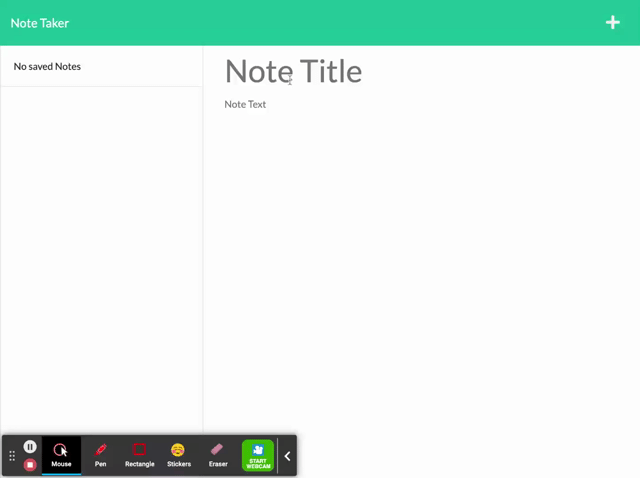
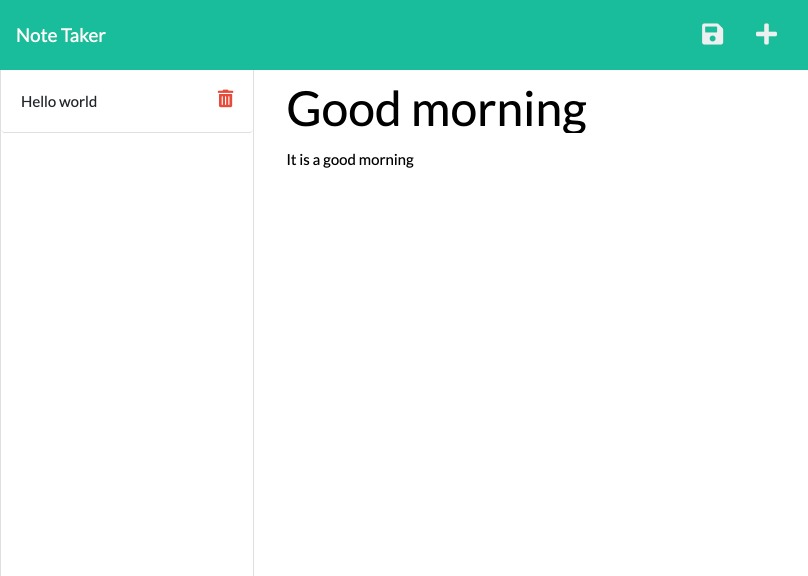

# NoteTakerApp

The assignment is to modify starter code to create an application called Note Taker that can be used to write and save notes. This application will use an Express.js back end and will save and retrieve note data from a JSON file. The application’s front end has already been created. It's your job to build the back end, connect the two, and then deploy the entire application to Heroku.

 ## Table of Contents 
  
  * [User Story](#userstory)
  * [Screenshots](#screenshots)
  * [Installation](#installation)
  * [Usage](#usage)
  * [Tech](#tech)
  * [License](#license)
  * [Contributors](#contributors)
  * [Tests](#tests)
  * [Questions](#questions)

## User Story

```
AS A small business owner
I WANT to be able to write and save notes
SO THAT I can organize my thoughts and keep track of tasks I need to complete
```

## Screenshots 
A little demo of how the app works. 


A screenshot of the deployed app. 


## Installation
Run `npm install`. 

Run `npm i express`.

Run `npm i uuid`.

## Usage
This application is being run on [Heroku](https://notetakervalbona.herokuapp.com/)

To run locally, use the command line to navigate to the root of the application and run `node server.js`. 

## Tech
- JavaScript
- HTML
- CSS (Bootstrap)
- UUID
- Express.js
- Heroku

## Contributors
It is an open project and everyone can contribute. Please email requesting to be added as a contributor.
  
## License
License is [MIT](https://opensource.org/licenses/MIT) standard license.

## Tests
No tests. 

## Questions
GitHub: https://github.com/valbona1992  <br/>
Email me with any questions: valbona12@gmail.com 
